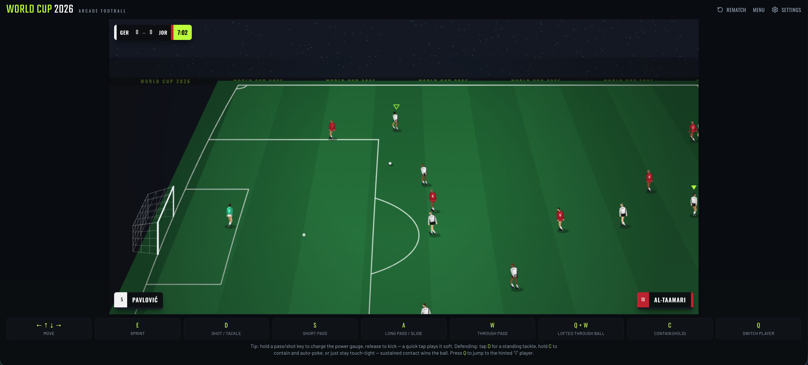

# World Cup 2026

An arcade, FIFA-style football game that runs entirely in your browser. Pick a national team and play a full match against the CPU — rendered live on `<canvas>` with a proper TV-style broadcast tele camera, just like FIFA.

<p align="center">
  <a href="https://worldcup2026.modelence.ai/">
    
  </a>
</p>

<p align="center">
  Play: <strong><a href="https://worldcup2026.modelence.ai/">worldcup2026.modelence.ai</a></strong>
</p>

## Features

- **11v11 matches** against the CPU with all the rules you'd expect — kickoffs, throw-ins, corners, goal kicks, offside, and full-time.
- **All 48 nations** from the 2026 World Cup, each with its own kits (including away/change strips), crests, and per-team skill ratings.
- **FIFA-style broadcast camera** — a pseudo-3D tele cam that follows the ball with smoothing, depth panning, and crowd/stadium parallax.
- **Deep control scheme** — charged shots and passes (hold to power up), through balls, lofted chips, player switching, and FIFA-style defending (standing tackles, slide tackles, contain/jockey).
- **Practice mode** — a free-form rehearsal pitch with a lone keeper and no match structure, so you can drill shooting and passing.
- **Rebindable keys** — remap any control from the in-game settings popup (persisted to `localStorage`).
- Fully client-side gameplay, no backend game state required.

## Controls

Defaults (all keys are rebindable in the settings popup):

| Action | Key |
| --- | --- |
| Move | Arrow keys |
| Sprint | `E` |
| Shot | `D` |
| Short pass | `S` |
| Long pass | `A` |
| Through pass | `W` |
| Lofted through ball | `Q` + `W` |
| Switch player | `Q` |
| Contain / jockey | `C` |

- **Charge mechanic:** shots and passes charge while the key is held and fire on release — hold longer for more power (watch the power meter at the bottom of the screen).
- **Defending:** with no ball at your feet, `D` performs a standing tackle; hold `C` to contain and jockey the carrier.

## Tech stack

- [Modelence](https://modelence.com/) full-stack framework
- React 19 + React Router
- Vite + Tailwind CSS v4
- TypeScript
- HTML5 Canvas + `requestAnimationFrame` for the game engine
- Optional Expo / React Native mobile app (in `mobile/`)

## Getting started

### Prerequisites

- Node.js 20+

### Install & run

```bash
npm install
npm run dev
```

This starts the Modelence dev server. Open the printed local URL in your browser to play.

### Build & start (production)

```bash
npm run build
npm run start
```

## Project structure

```
.
├── src/
│   ├── client/
│   │   ├── game/        # Game engine, split by domain
│   │   │   ├── engine.ts      # PitchKickGame: loop, physics, input, AI, rules
│   │   │   ├── render.ts      # Pure canvas renderer (broadcast camera)
│   │   │   ├── projection.ts  # TV camera projection & clamps
│   │   │   ├── constants.ts   # World scale / geometry / physics tunables
│   │   │   ├── math.ts        # Pure math helpers
│   │   │   └── types.ts       # Shared game types
│   │   └── pages/
│   │       └── HomePage.tsx   # Canvas host, HUD, menus, team select
│   └── server/          # Modelence backend modules
├── mobile/              # Optional Expo / React Native app
├── scripts/             # postinstall + tooling
└── modelence.config.ts
```

The game engine was split by domain out of an earlier monolithic `engine.ts`. The `engine.ts` class holds all stateful logic (game loop, physics, input, AI, possession, match rules), while geometry, math, projection, types, and rendering live in their own pure, import-light modules.

Shared types/logic intended for both web and mobile should live under `src/shared/`.

## License

See the repository for license details.
